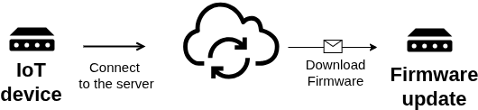

# FOTA

**FOTA** stands for **Firmware Over-The-Air**.\
It’s the process of **remotely updating a device’s firmware** over a wireless network (Wi-Fi, cellular, LoRa, etc.), without needing a physical cable connection.

#### Typical Uses

* Updating IoT devices deployed in the field
* Fixing bugs or adding new features
* Adjusting embedded system parameters without retrieving the equipment

* A better example is the ESP32, which supports FOTA via **HTTP/HTTPS** or **MQTT**, using the **OTA** API from ESP-IDF or Arduino libraries.
* The firmware is downloaded to a secondary partition, validated, and then the device boots into the new firmware.

***

<figure><figcaption>
<strong>Firmware Over-The-Air</strong>
</figcaption></figure>

***

**One-sentence:**\
FOTA is a technique that remotely updates firmware over a network, improving convenience and reducing maintenance costs for embedded/IoT devices.
