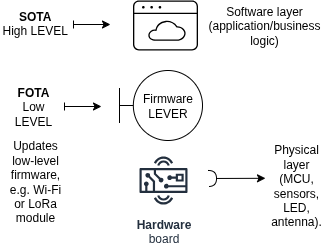

# SOTA

**SOTA** (Software Over-The-Air) is an essential technology in IoT because it allows you to keep devices up-to-date, secure, and functional without having to physically touch them.

**FOTA** = lowest level (firmware) → communication with hardware.

**SOTA** = highest level (software/application) → device functionality and logic.

***

Many IoT devices **use both**:

**FOTA** to fix hardware/protocol bugs.

**SOTA** will update the application logic without modifying the firmware.

***

<figure><figcaption></figcaption></figure>
